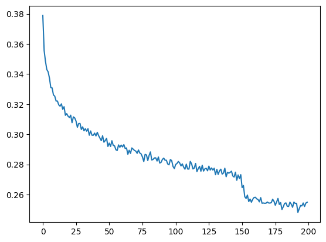

# TextFlow

## ✦ About

**TextFlow** is a deep learning project that explores the evolution of character-level language models, culminating in a WaveNet-inspired architecture capable of generating realistic, novel names.

What began as a simple bigram frequency model grew into a layered neural pipeline — from basic MLPs to dilated convolutional networks — each improving upon the last in both loss and linguistic complexity. 

The project is a study in architectural progression, custom PyTorch implementation, and hands-on experimentation with generative modeling.

Rather than relying on high-level libraries, most components were built from scratch — allowing deeper understanding of tokenization, batching, embeddings, and model internals.

The final model produces outputs that resemble human names in style, phonetics, and structure — blending linguistic coherence with generative creativity.


---

## ✦ Project Objective

The goal of TextFlow is to explore how model complexity impacts the quality of text generation. By starting from a basic bigram frequency model and scaling up to a WaveNet-inspired deep neural network, the project highlights improvements in:

- Prediction accuracy
- Loss reduction
- Generation realism

This journey from simple to advanced models gives an in-depth view of how architectures learn textual patterns over time.

---

## ✦ What Has Been Implemented

The project is divided into four stages:

### 1. Bigram Language Model
- Character pair frequency model
- No learning parameters
- Generates names purely based on transition probabilities

### 2. MLP (Multi-Layer Perceptron)
- Fully connected network trained on n-grams
- Learns embeddings and basic sequence dependencies
- Implemented from scratch in PyTorch

### 3. Intermediate MLP Optimizations
- Hyperparameter tuning
- Manual batching and weight decay experiments
- Better generalization and reduced overfitting

### 4. WaveNet-Inspired Model
- Uses a stack of dilated 1D convolutional layers
- Captures long-range dependencies in character sequences
- Fully vectorized PyTorch implementation
- Best performance in both loss and quality of name generation

---

## ✦ Sample Names Generated by the WaveNet Model

|         |         |         |         |              |
|---------|---------|---------|---------|--------------|
| jahya   | usten   | lorrison| adrianna| franciea     |
| kaylen  | mccenne | bawson  | briyon  | sylonna      |
| jaice   | myndal  | dayphos | petric  | isabellamaris|
| hulayah | sirence | ayen    | edulija | rohan        |


These names were generated after training on a curated dataset of real human names. Notice how the model not only mimics realistic phonetics but also forms longer and more complex structures like `isabellamaris` and `edulija`.

---

## ✦ Loss Curve




---

## ✦ Loss Comparison Across Models

| Model               | Final Training Loss |
|---------------------|---------------------|
| Bigram              | 2.48                |
| MLP                 | 2.07                |
| WaveNet             | 1.83                |
| Initial (Untrained) | 3.25                |

As evident, the progression from simple to deep architectures led to consistent improvements in training loss.

---

## ✦ Folder Structure
<!-- TREEVIEW START -->
```bash
text-flow/
├── data/ # Dataset of names (input)
├── notebooks/ # Jupyter experiments and model development
├── models/ # PyTorch model definitions (MLP, WaveNet)
└── README.md
```
<!-- TREEVIEW END -->
---

## ✦ Acknowledgment

This project is heavily inspired by the brilliant [Zero to Hero: Neural Networks](https://www.youtube.com/watch?v=PaCmpygFfXo&list=PLAqhIrjkxbuWI23v9cThsA9GvCAUhRvKZ&index=2) series by [Andrej Karpathy](https://github.com/karpathy).

The core training flow, batching strategy, and model progression follow the hands-on walkthrough taught in the videos. This repository serves as a personal deep-dive, with minor modifications, additional experiments, and a stronger focus on code clarity and packaging.
